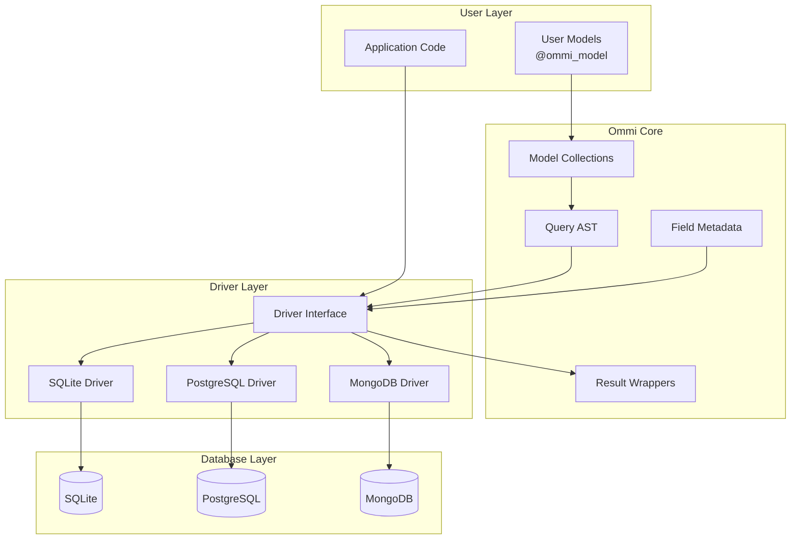
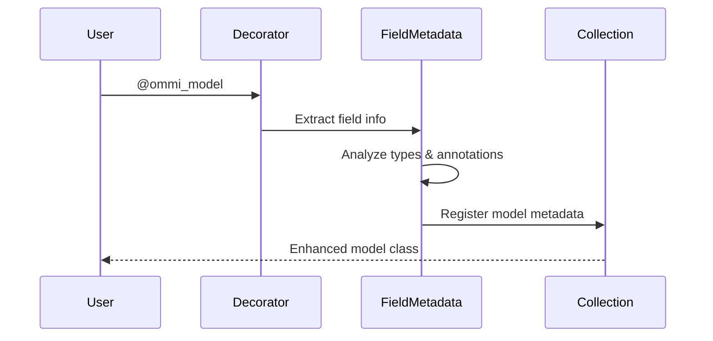
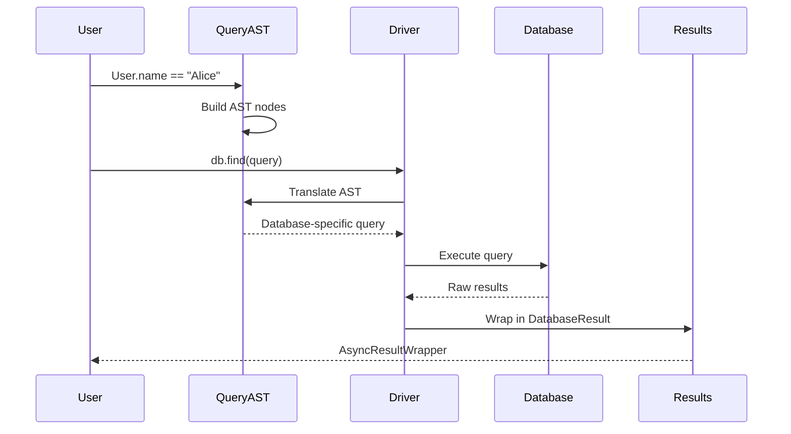
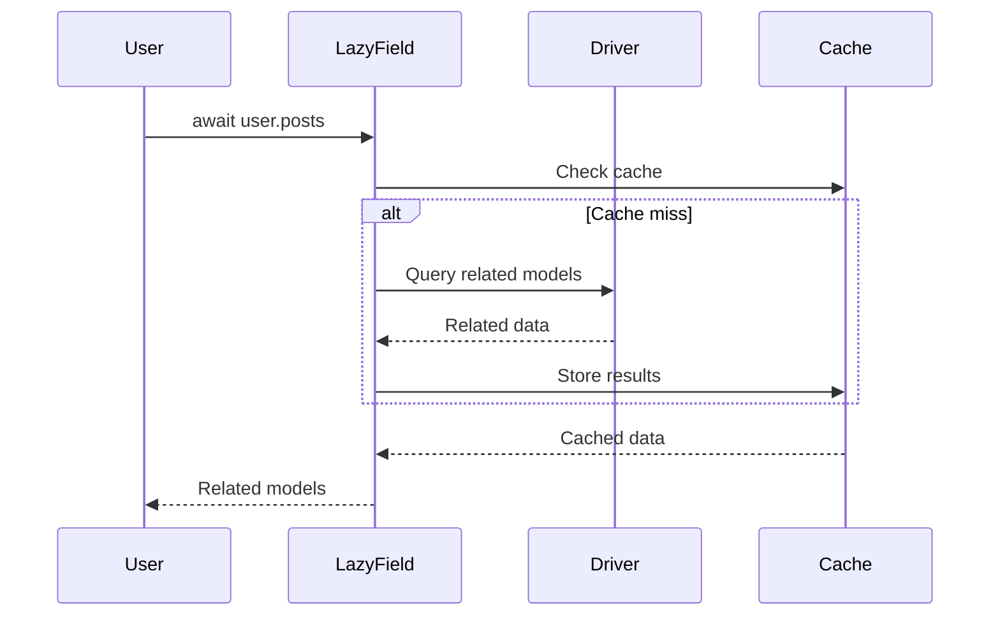
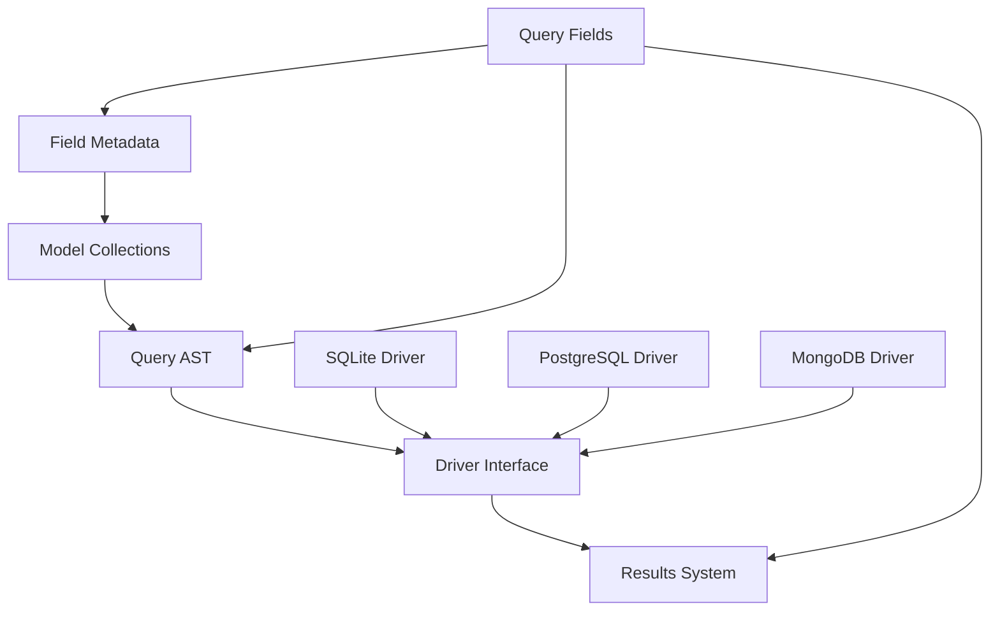

# Component Overview

## System Architecture Diagram



## Core Components

### 1. Model System (`ommi/models/`)

The model system provides the foundation for defining and managing data structures that can be persisted across different databases.

#### Model Collections (`collections.py`)
**Purpose:** Group related models for schema management and organization

**Key Features:**
- Global and named collections
- Model registration and discovery
- Schema management coordination
- Namespace isolation

**Usage Pattern:**
```python
# Global collection (default)
@ommi_model
@dataclass
class User:
    name: str

# Named collection
collection = ModelCollection()

@ommi_model(collection=collection)
@dataclass  
class Product:
    name: str
```

#### Field Metadata (`field_metadata.py`)
**Purpose:** Extract and store comprehensive field information from any model type

**Key Features:**
- Type detection and validation
- Constraint extraction (e.g., max length, required)
- Relationship definitions
- Database-specific annotations

**Core Classes:**
- `FieldMetadata`: Complete field description
- `ReferenceTo`: Foreign key relationships
- `Key`: Primary key designation

**Example:**
```python
@ommi_model
@dataclass
class User:
    id: Annotated[int, Key] = None
    name: Annotated[str, MaxLength(100)] = ""
    email: Annotated[str, Unique] = ""
```

#### Query Fields (`query_fields.py`)
**Purpose:** Provide lazy loading relationship fields for efficient data access

**Key Classes:**
- `LazyLoadTheRelated`: Single related object (one-to-one, many-to-one)
- `LazyLoadEveryRelated`: Multiple related objects (one-to-many, many-to-many)

**Features:**
- Async loading with caching
- Association table support
- Forward reference handling
- Error handling and defaults

### 2. Query System (`query_ast.py`)

The query system translates user-friendly Python expressions into database-agnostic query representations.

#### Abstract Syntax Tree Components

**`ASTReferenceNode`**: Field references
```python
User.name  # Creates ASTReferenceNode(field="name", model=User)
```

**`ASTComparisonNode`**: Comparison operations
```python
User.age > 18  # Creates comparison node with GREATER_THAN operator
```

**`ASTLogicalOperatorNode`**: Logical combinations
```python
(User.age > 18) & (User.active == True)  # Creates AND node
```

**`ASTGroupNode`**: Grouping and ordering
```python
db.find(User).order_by(User.name)  # Creates ordering group
```

#### Query Translation Flow
1. **User Expression:** `User.name == "Alice"`
2. **AST Generation:** Comparison node with reference and literal
3. **Driver Translation:** Convert to SQL `WHERE name = ?` or MongoDB `{"name": "Alice"}`
4. **Execution:** Run database-specific query
5. **Result Mapping:** Convert back to model instances

### 3. Driver System

The driver system provides the interface between Ommi's abstract operations and specific database implementations.

#### Driver Interface (`drivers/drivers.py`)
**Purpose:** Define standard operations all drivers must implement

**Core Operations:**
- `add()`: Insert new records
- `fetch()`: Query and retrieve records
- `update()`: Modify existing records  
- `delete()`: Remove records
- `count()`: Count matching records
- `schema()`: Manage database schema

**Transaction Support:**
- `begin_transaction()`: Start transaction
- `commit()`: Commit changes
- `rollback()`: Revert changes

#### Database-Specific Drivers

Each driver follows the clean separation pattern:
- **Return concrete types or raise exceptions** (NO result wrapping)
- **Database-specific error handling** with appropriate exception types
- **Raw operations only** - interface layer handles all wrapping

**SQLite Driver (`ext/drivers/sqlite/`)**
- File-based database support
- SQL query generation
- Transaction management with savepoints
- Schema creation and migration
- Returns: `List[Model]`, `int`, etc. or raises `DatabaseError`

**PostgreSQL Driver (`ext/drivers/postgresql/`)**
- Connection pooling
- Advanced SQL features
- JSON/JSONB support
- Full transaction isolation
- Returns: `List[Model]`, `int`, etc. or raises `DatabaseError`

**MongoDB Driver (`ext/drivers/mongodb/`)**
- Document-based operations
- Aggregation pipeline support
- Collection management
- GridFS for large files
- Returns: `List[Model]`, `int`, etc. or raises `DatabaseError`

### 4. Interface Layer and Results System

The interface layer sits between user code and drivers, handling all result wrapping and providing consistent error handling patterns.

#### Interface Layer Responsibilities
- **Result Wrapping:** Convert driver returns/exceptions to `DatabaseResult` objects
- **Error Standardization:** Convert driver-specific exceptions to standard error types  
- **Async Coordination:** Manage `AsyncResultWrapper` creation and handling
- **Cross-cutting Concerns:** Logging, caching, retry logic

#### Result Wrappers

**`AsyncResultWrapper`**: Awaitable wrapper with convenience methods
```python
# Multiple ways to handle results  
result = db.find(User.name == "Alice").count()  # Interface layer creates wrapper

# Direct await returns DatabaseResult
db_result = await result

# Convenience methods
count = await result.value  # Raises on error
count = await result.value_or(0)  # Returns default on error
await result.raise_on_errors()  # Raises exception, discards value
```

**`DatabaseResult`**: Success/Failure result type
```python
match await db.find(User.name == "Alice").count():
    case DatabaseResult.Success(value):
        print(f"Found {value} users")
    case DatabaseResult.Failure(error):
        print(f"Query failed: {error}")
```

## Component Interactions

### Model Registration Flow


### Query Execution Flow


### Lazy Loading Flow


## Component Dependencies

### Dependency Graph


### Circular Dependency Management
- **Models → Drivers:** Models need drivers for operations
- **Drivers → Models:** Drivers need model metadata for schema
- **Solution:** Lazy loading and registration patterns

## Component Testing Strategy

### Unit Testing
Each component is tested in isolation:
```python
# Field metadata testing
def test_field_metadata_extraction():
    metadata = extract_field_metadata(User)
    assert "name" in metadata.fields
    assert metadata.fields["name"].type == str

# Query AST testing  
def test_query_ast_generation():
    query = User.name == "Alice"
    assert isinstance(query, ASTComparisonNode)
    assert query.operator == ASTOperatorNode.EQUALS
```

### Integration Testing
Components tested together:
```python
# Model + Driver integration
async def test_model_driver_integration():
    await db.add(User(name="Alice"))
    users = await db.find(User.name == "Alice").fetch.all()
    assert len(users) == 1
```

### Cross-Component Testing
Full system behavior validation:
```python
# End-to-end testing
async def test_lazy_loading_integration():
    user = await db.find(User.name == "Alice").fetch.one()
    posts = await user.posts  # Tests lazy loading + driver + results
    assert isinstance(posts, list)
```

## Component Evolution

### Current Limitations
- **Result System:** Inconsistent wrapping causing `DBStatusNoResultException`
- **Query AST:** Missing operators limiting query capabilities
- **Driver Compliance:** Inconsistent feature implementation

### Planned Improvements
- **Enhanced Type System:** Better type validation and conversion
- **Query Optimization:** AST analysis for performance optimization
- **Plugin Architecture:** Allow third-party components

### Backwards Compatibility
- **Interface Stability:** Core interfaces remain stable
- **Deprecation Process:** Clear migration path for changes
- **Version Strategy:** Semantic versioning with clear breaking change communication