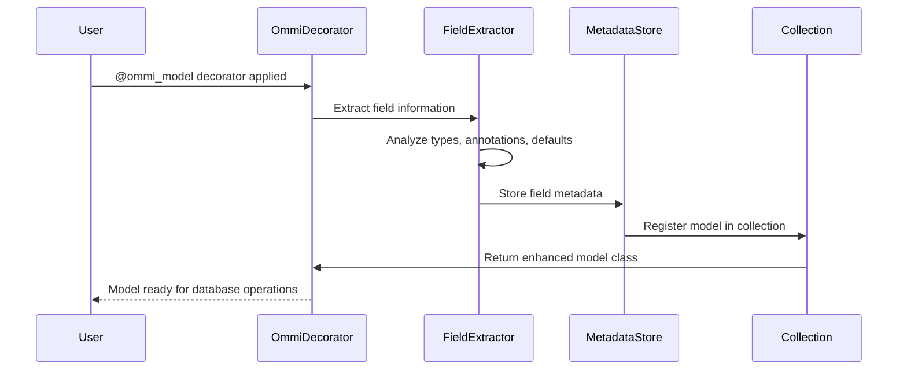
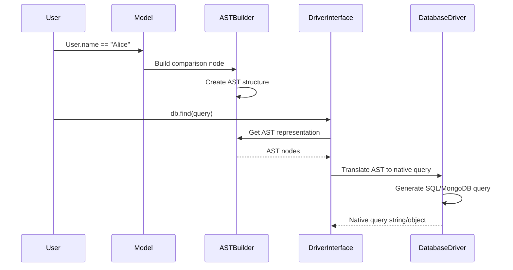
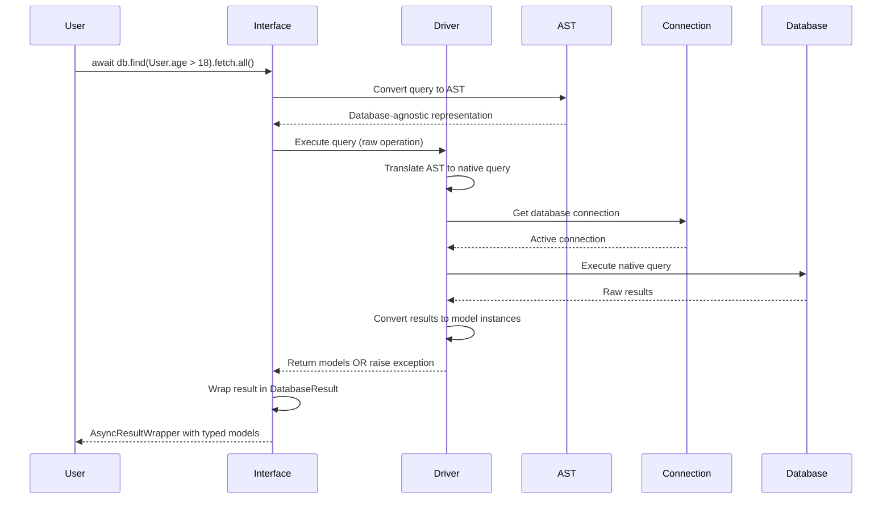
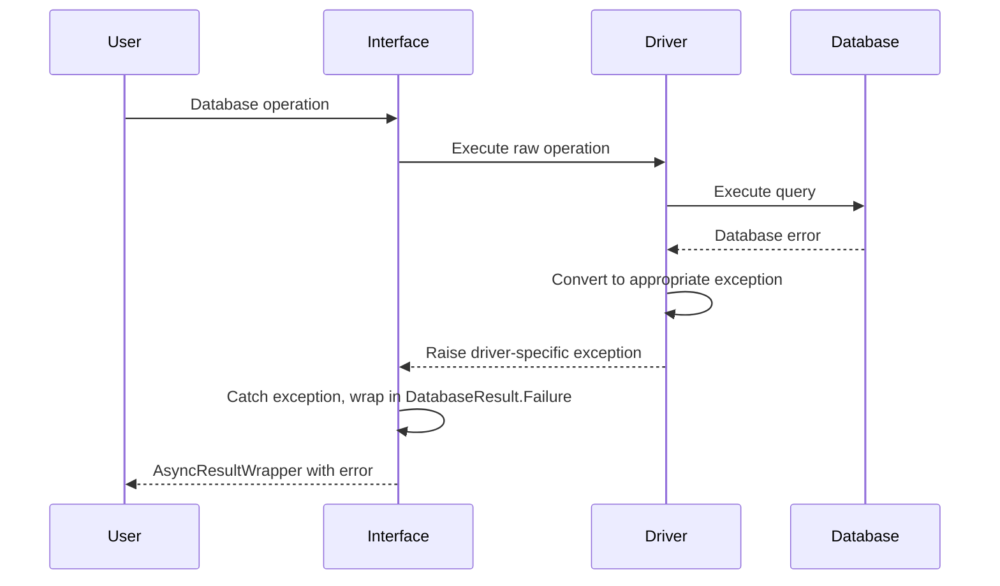
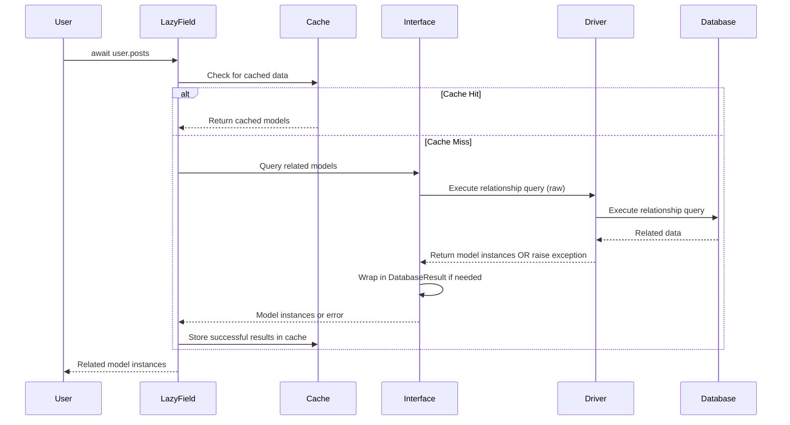
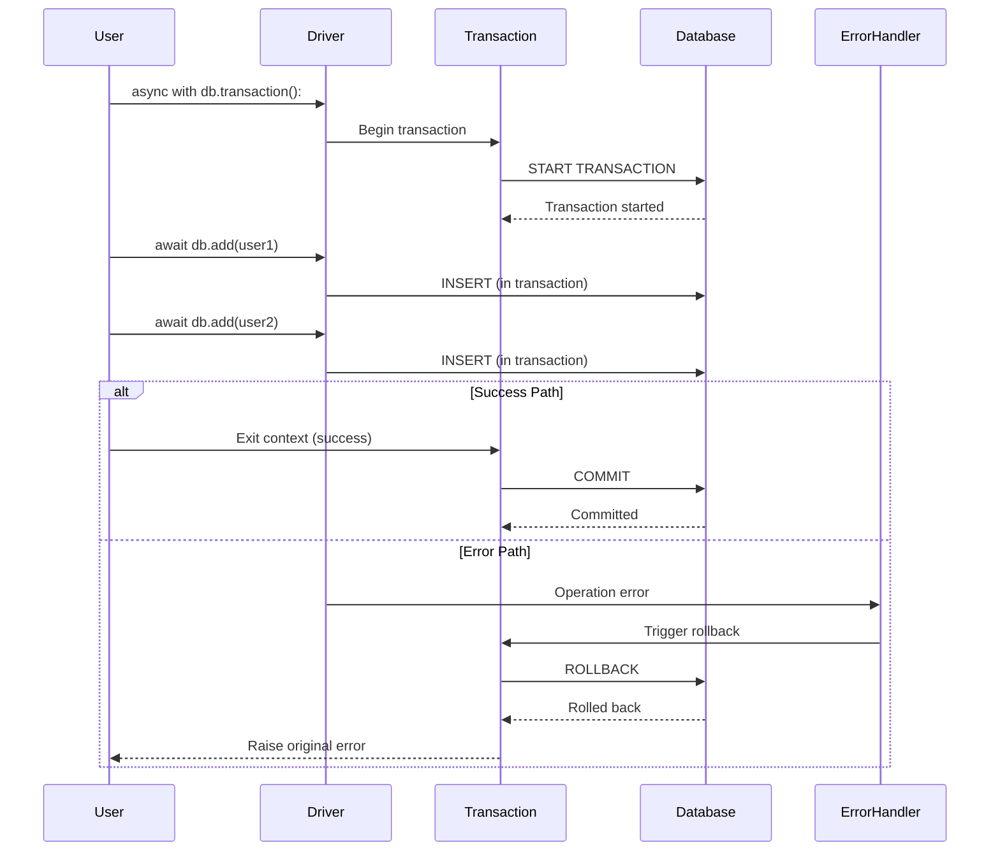
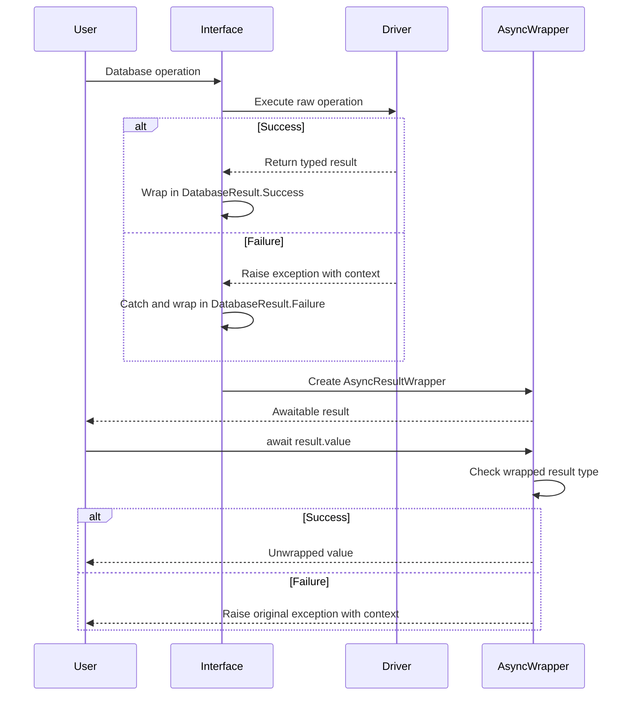
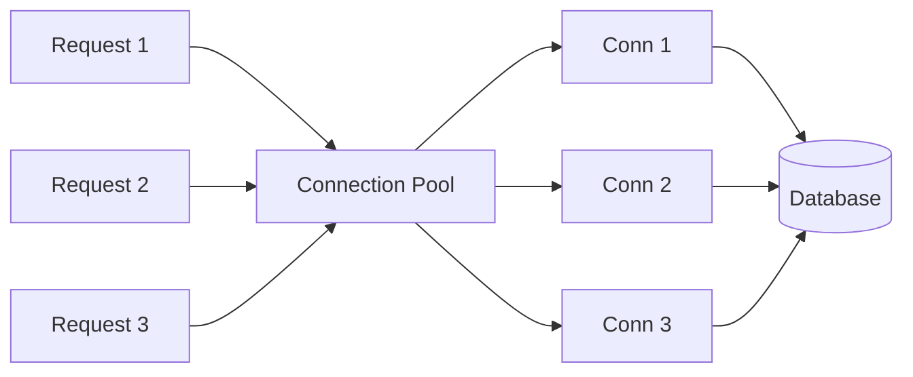
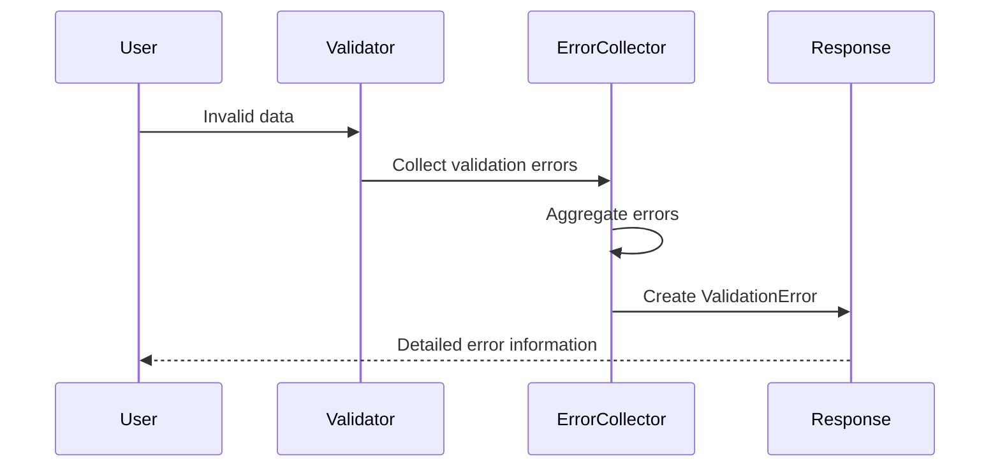
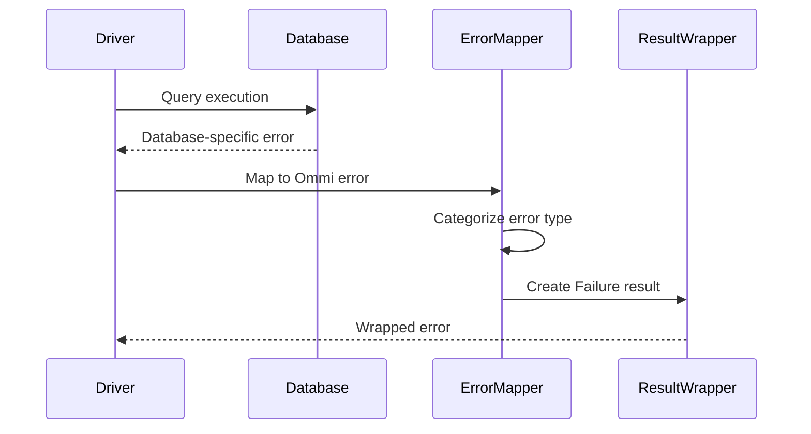

# Data Flow Patterns

## Overview
This document describes the key data flow patterns in Ommi, showing how data moves through the system from user operations to database interactions and back.

## Core Data Flow Patterns

### 1. Model Registration Pattern

#### Flow Description
When a model is decorated with `@ommi_model`, the system extracts metadata and registers the model for database operations.



#### Key Steps
1. **Decoration:** `@ommi_model` applied to user class
2. **Introspection:** Field types, annotations, and constraints extracted
3. **Metadata Creation:** `FieldMetadata` objects created for each field
4. **Registration:** Model registered in appropriate collection
5. **Enhancement:** Original class enhanced with database capabilities

#### Example
```python
@ommi_model
@dataclass
class User:
    name: str
    age: int
    id: Annotated[int, Key] = None

# Behind the scenes:
# 1. FieldExtractor finds 'name', 'age', 'id' fields
# 2. Creates FieldMetadata for each with type info
# 3. Identifies 'id' as primary key from Key annotation
# 4. Registers User in global collection
# 5. Adds database methods to User class
```

### 2. Query Building Pattern

#### Flow Description
User queries are converted from Python expressions to database-agnostic AST, then translated to database-specific queries.



#### AST Node Creation
```python
# User writes:
User.name == "Alice"

# Creates AST:
ASTComparisonNode(
    left=ASTReferenceNode(field="name", model=User),
    operator=ASTOperatorNode.EQUALS,
    right=ASTLiteralNode(value="Alice")
)

# Translates to:
# SQL: WHERE name = ?
# MongoDB: {"name": "Alice"}
```

### 3. Database Operation Pattern

#### Flow Description
Database operations follow a clean separation pattern where drivers handle raw operations and the interface layer manages result wrapping.



#### Error Handling Flow


### 4. Lazy Loading Pattern

#### Flow Description
Lazy loading provides on-demand loading of related models with caching for performance, using the interface layer for result handling.



#### Lazy Loading States
```python
class LazyLoadState(Enum):
    NOT_LOADED = "not_loaded"
    LOADING = "loading"
    LOADED = "loaded"
    ERROR = "error"
```

#### Cache Management
```python
# Lazy field caching strategy
class LazyLoadTheRelated:
    def __init__(self):
        self._state = LazyLoadState.NOT_LOADED
        self._cached_result = None
        self._error = None
    
    async def __await__(self):
        if self._state == LazyLoadState.LOADED:
            return self._cached_result
        
        if self._state == LazyLoadState.LOADING:
            # Wait for concurrent load to complete
            await self._wait_for_load()
            return self._cached_result
        
        return await self._load_data()
```

### 5. Transaction Management Pattern

#### Flow Description
Transactions ensure data consistency across multiple operations with proper rollback on errors.



#### Nested Transaction Handling
```python
# Nested transaction with savepoints
async with db.transaction() as tx1:          # BEGIN
    await db.add(user1)
    
    async with db.transaction() as tx2:      # SAVEPOINT sp1
        await db.add(user2)
        # Error occurs here
        raise Exception("Something went wrong")  # ROLLBACK TO sp1
    
    await db.add(user3)                      # Still in tx1
    # tx1 commits successfully               # COMMIT
```

### 6. Result Processing Pattern

#### Flow Description
Results are consistently wrapped at the interface layer, with drivers handling only raw operations.



#### Result Chaining
```python
# Fluent result handling
result = await (db.find(User.name == "Alice")
    .fetch()
    .value_or([]))  # Returns empty list on error

# Pattern matching
match await db.add(user):
    case DatabaseResult.Success(added_user):
        print(f"Added user: {added_user.id}")
    case DatabaseResult.Failure(error):
        print(f"Failed to add user: {error}")
```

## Data Transformation Patterns

### 1. Model to Database Pattern

#### Python Model → Database Record
```python
# Input: Python model instance
user = User(name="Alice", age=25)

# Driver-specific transformation:
# SQLite: (name, age) VALUES (?, ?)
# MongoDB: {"name": "Alice", "age": 25}
# PostgreSQL: INSERT INTO users (name, age) VALUES ($1, $2)
```

### 2. Database to Model Pattern

#### Database Record → Python Model
```python
# SQLite result: (1, "Alice", 25)
# MongoDB result: {"_id": ObjectId(...), "name": "Alice", "age": 25}
# PostgreSQL result: Row(id=1, name="Alice", age=25)

# All become:
user = User(id=1, name="Alice", age=25)
```

### 3. Query Translation Pattern

#### Python Expression → Database Query
```python
# Python expression
query = (User.age > 18) & (User.active == True)

# SQLite translation
"WHERE age > ? AND active = ?"

# MongoDB translation
{"$and": [{"age": {"$gt": 18}}, {"active": True}]}

# PostgreSQL translation  
"WHERE age > $1 AND active = $2"
```

## Performance Optimization Patterns

### 1. Connection Pooling


### 2. Query Batching
```python
# Instead of N+1 queries
users = await db.find(User.active == True).fetch.all()
for user in users:
    posts = await user.posts  # N queries

# Use prefetching (planned feature)
users = await db.find(User.active == True).prefetch("posts").fetch.all()
for user in users:
    posts = user.posts.cached_value  # No additional queries
```

### 3. Lazy Loading Optimization
```python
# Cached lazy loading prevents duplicate queries
user = await db.find(User.id == 1).fetch.one()
posts1 = await user.posts  # Database query
posts2 = await user.posts  # Cache hit, no query
```

## Error Flow Patterns

### 1. Validation Error Flow


### 2. Database Error Flow


## Flow Performance Metrics

### Latency Targets
- **Model Registration:** <1ms per model
- **Query Building:** <0.1ms per query node
- **Database Operation:** <10ms + database latency
- **Result Processing:** <1ms per result set
- **Lazy Loading:** <5ms + relationship query time

### Throughput Targets
- **Concurrent Operations:** >1000 ops/second
- **Batch Inserts:** >5000 records/second
- **Query Results:** >10000 records/second processing
- **Connection Pool:** >100 concurrent connections

These patterns ensure consistent, predictable data flow throughout the Ommi system while maintaining performance and reliability.