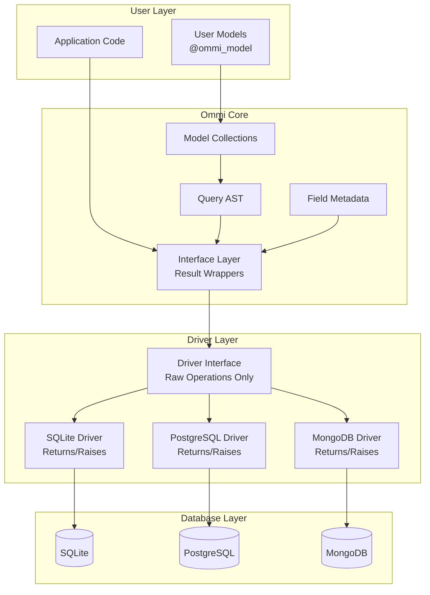

# Ommi System Architecture - Overview

## Architecture Documentation Structure

This system architecture is organized into focused documents for better navigation and understanding:

### 📋 Core Architecture Documents

1. **[Core Design Principles](core_design_principles.md)** - Fundamental design principles that guide all architectural decisions
2. **[Component Overview](component_overview.md)** - Detailed breakdown of system components and their interactions  
3. **[Data Flow Patterns](data_flow_patterns.md)** - How data moves through the system from user operations to database
4. **[Current Issues Analysis](current_issues_analysis.md)** - Analysis of existing architectural problems and their impacts
5. **[Proposed Improvements](proposed_improvements.md)** - Planned architectural enhancements and solutions

## Quick Architecture Summary

### System Overview
Ommi is a portable object model mapper designed to provide a consistent interface across different databases while supporting multiple model libraries (dataclasses, Attrs, Pydantic).

### High-Level Architecture

### Core Principles
1. **Database Agnostic** - Consistent interface across SQL and NoSQL databases
2. **Model Library Agnostic** - Works with any Python model library (dataclasses, Attrs, Pydantic)
3. **Async-First** - All database operations are asynchronous for optimal performance

### Current Status
- **Test Success Rate:** 40.5% (17/42 tests passing)
- **Critical Issues:** Result system inconsistencies, incomplete query AST, driver implementation gaps
- **Priority:** Immediate stabilization required before feature development

## Navigation Guide

### For Understanding Current Issues
- Start with **[Current Issues Analysis](current_issues_analysis.md)** for detailed problem breakdown
- Review **[Component Overview](component_overview.md)** to understand affected components

### For Planning Fixes  
- Review **[Proposed Improvements](proposed_improvements.md)** for solution strategies
- Check **[Data Flow Patterns](data_flow_patterns.md)** to understand expected behavior

### For Understanding Design Decisions
- Read **[Core Design Principles](core_design_principles.md)** for foundational concepts
- See **[Component Overview](component_overview.md)** for implementation details

## Key Architecture Decisions

### 1. Why Abstract Syntax Tree for Queries?
- **Database Independence:** Same query logic works across SQL/NoSQL
- **Type Safety:** Compile-time query validation
- **Optimization:** Query analysis and optimization opportunities

### 2. Why Async-First Design?
- **Performance:** Non-blocking database operations
- **Scalability:** Handle many concurrent requests  
- **Modern Python:** Aligns with current async ecosystem

### 3. Why Model Agnostic Approach?
- **User Choice:** Work with preferred model library
- **Migration Path:** Easy adoption in existing projects
- **Future-Proof:** New model libraries can be supported

## Implementation Status

### ✅ Working Components
- Basic model registration and metadata extraction
- Simple query AST nodes and basic operations
- Driver interface definition
- Basic SQLite driver functionality

### ❌ Broken Components  
- Driver/interface separation (drivers incorrectly wrapping results)
- Lazy loading relationships (expecting wrapped results from drivers)
- Advanced query operators (`.contains()`, `.in_()`, etc.)
- Transaction isolation

### 🔄 Partially Working
- SQLite driver (basic CRUD works, advanced features broken)
- Query system (simple comparisons work, complex queries fail)
- Error handling (inconsistent across drivers)

## Next Steps

1. **Read detailed analysis** in the focused architecture documents
2. **Review critical issues** in Current Issues Analysis  
3. **Plan implementation** using Proposed Improvements
4. **Start with driver/interface separation** as highest priority - see [Driver Interface Pattern](driver_interface_pattern.md)

For comprehensive understanding, please review each individual architecture document for detailed information on specific aspects of the system.