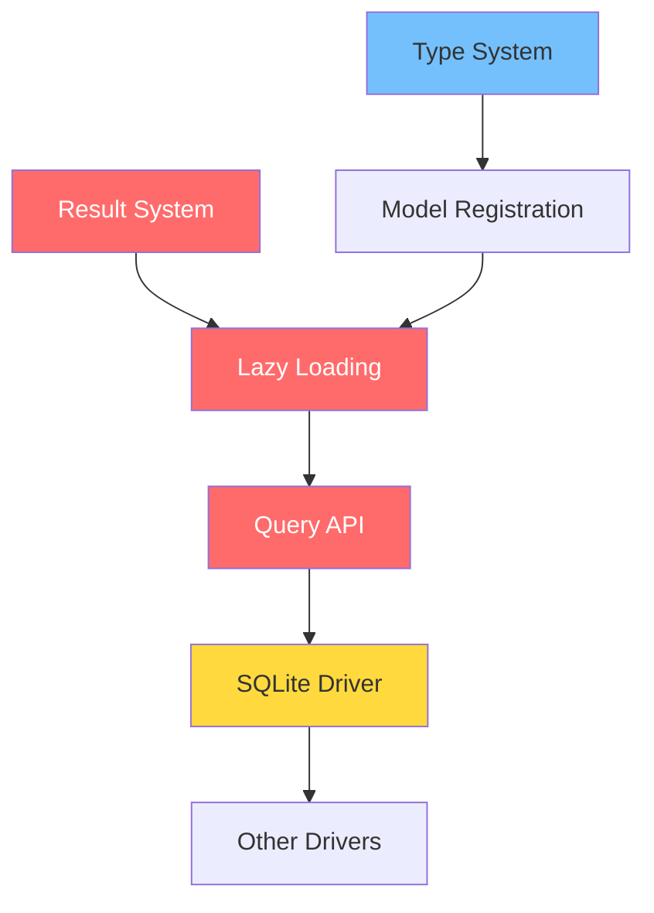

# Critical Issues - Overview

## Issues Documentation Structure

The critical issues analysis has been broken down into focused documents for better navigation and actionability:

### 🔥 Critical Issue Documents

1. **[Lazy Loading Failure](lazy_loading_failure.md)** - Core ORM relationship functionality completely broken
2. **[Query API Incomplete](query_api_incomplete.md)** - Missing essential query operators and methods
3. **[SQLite Driver Issues](sqlite_driver_issues.md)** - Primary testing driver has multiple critical problems
4. **[Type System Problems](type_system_problems.md)** - Runtime type validation failures with modern Python
5. **[Issue Dependencies](issue_dependencies.md)** - Analysis of how issues relate and optimal fix sequence

## Quick Issues Summary

### Project Status
**Current Version:** 0.2.1  
**Test Success Rate:** 40.5% (17/42 tests passing)  
**Priority:** HIGH - Multiple critical functionality gaps requiring immediate attention

### Critical Issues Priority Matrix

#### 🔥 CRITICAL (Fix Immediately)
1. **[Lazy Loading Failure](lazy_loading_failure.md)** - `DBStatusNoResultException` breaking core ORM functionality
2. **[Query API Incomplete](query_api_incomplete.md)** - Missing operators limiting query expressiveness  
3. **Result System Issues** - Inconsistent result wrapping throughout codebase

#### ⚠️ HIGH (Fix Next)
4. **[SQLite Driver Issues](sqlite_driver_issues.md)** - Reserved keywords, transactions, syntax errors
5. **[Type System Problems](type_system_problems.md)** - `TypeError: issubclass()` with modern Python types

#### 📈 MEDIUM (Planned)
6. **Cross-Driver Compatibility** - Ensure consistent behavior across databases
7. **Transaction Management** - Advanced transaction features and isolation
8. **Performance Optimization** - Connection pooling, query optimization

## Navigation Guide

### For Understanding Specific Issues
- **[Lazy Loading Failure](lazy_loading_failure.md)** - If relationship traversal is broken
- **[Query API Incomplete](query_api_incomplete.md)** - If you're missing query operators  
- **[SQLite Driver Issues](sqlite_driver_issues.md)** - If you're having SQL syntax/transaction problems
- **[Type System Problems](type_system_problems.md)** - If you're getting type validation errors

### For Planning Fixes
- **[Issue Dependencies](issue_dependencies.md)** - Shows optimal fix sequence and what blocks what
- Review individual issue documents for detailed implementation plans

### For Understanding Impact
Each issue document includes:
- Root cause analysis with code examples
- Affected components and test cases
- Step-by-step fix strategies
- Success criteria and validation tests

## Critical Path Dependencies

**Critical Path:** Result System → Lazy Loading → Query API → SQLite Driver → Cross-Driver Compatibility

## Immediate Next Steps

### This Week (High Impact)
1. **Start with [Lazy Loading Failure](lazy_loading_failure.md)** - Highest impact fix
2. **Address [Type System Problems](type_system_problems.md)** - Enables model registration  
3. **Fix [SQLite Driver Issues](sqlite_driver_issues.md)** - Reserved keywords (quick win)

### Next Week (Foundation)
1. **Complete [Query API Incomplete](query_api_incomplete.md)** - Restore full query capabilities
2. **Finish SQLite driver stabilization** - Enable reliable testing
3. **Cross-component integration testing** - Ensure fixes work together

### Timeline Overview
- **Weeks 1-2:** Critical fixes (lazy loading, type system, basic SQLite)
- **Weeks 3-4:** Feature completion (query API, driver stability)  
- **Weeks 5-6:** Stabilization and cross-driver compatibility

## Success Metrics

### Phase 1 Targets (Critical Fixes)
- [ ] Zero `DBStatusNoResultException` errors
- [ ] Zero `TypeError: issubclass()` errors
- [ ] Basic relationship traversal working
- [ ] Test success rate >60%

### Phase 2 Targets (Stabilization)  
- [ ] All documented query operators working
- [ ] SQLite driver fully stable
- [ ] Test success rate >80%

### Phase 3 Targets (Production Ready)
- [ ] All drivers passing compliance tests  
- [ ] Transaction isolation working correctly
- [ ] Test success rate >95%

For detailed analysis and implementation plans, please review the individual issue documents. The [Issue Dependencies](issue_dependencies.md) document is particularly important for understanding the optimal sequence of fixes.