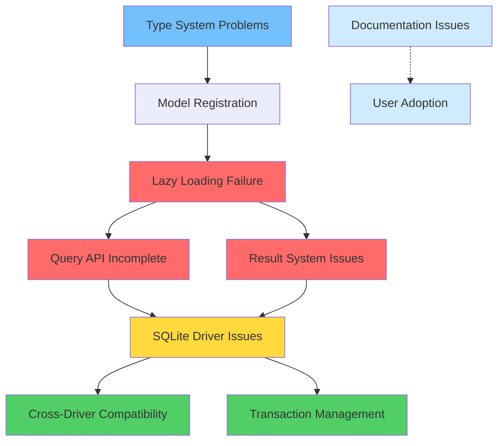

# Issue Dependencies and Fix Priorities

## Dependency Analysis

Understanding the relationships between issues is crucial for determining the optimal fix order. Some issues block others, while some can be addressed in parallel.

## Dependency Graph



## Critical Path Analysis

### 1. Primary Critical Path
```
Result System Issues → Lazy Loading Failure → Query API → SQLite Driver → Cross-Driver
```

**Reasoning:** 
- Lazy loading depends on proper result wrapping
- Query API testing requires working lazy loading
- Driver stability needs complete query API
- Other drivers need stable SQLite as reference

### 2. Secondary Critical Path
```
Type System Problems → Model Registration → Lazy Loading Failure
```

**Reasoning:**
- Model registration fails with type errors
- Lazy loading requires properly registered models
- Both are needed for basic functionality

## Detailed Dependency Analysis

### 1. Lazy Loading Failure Dependencies

#### Blocks:
- **Query API Completion** - Can't test query operators without working relationships
- **Driver Compliance Testing** - Relationship tests are core part of driver validation
- **User Experience** - Core ORM feature non-functional

#### Depends On:
- **Result System Fixes** - Lazy loading needs consistent result wrapping
- **Basic Type System** - Model registration must work for relationship setup

#### Parallel Development:
- **SQLite syntax fixes** - Can be developed alongside lazy loading fixes
- **Documentation updates** - Can document expected behavior

### 2. Query API Incomplete Dependencies

#### Blocks:
- **Advanced User Queries** - Users can't express complex filtering
- **Driver Feature Parity** - All drivers need to support same operators
- **Performance Testing** - Can't benchmark without complete query support

#### Depends On:
- **Lazy Loading Working** - Need relationships to test complex queries
- **Basic Driver Stability** - Need reliable query execution

#### Parallel Development:
- **Operator implementation** - Can add operators independently
- **Driver translation** - Each driver can implement translation separately

### 3. SQLite Driver Issues Dependencies

#### Blocks:
- **Reliable Testing** - Primary testing driver must be stable
- **Other Driver Development** - SQLite serves as reference implementation
- **Performance Benchmarking** - Need stable baseline for comparisons

#### Depends On:
- **Query API** - Need complete query support to test all features
- **Result System** - Need consistent result handling

#### Parallel Development:
- **Reserved keyword fixes** - Independent of other issues
- **Transaction improvements** - Can be developed separately

### 4. Type System Problems Dependencies

#### Blocks:
- **Modern Python Support** - Framework looks outdated with type issues
- **Model Registration** - Complex models fail to register
- **Schema Generation** - Can't create tables for complex types

#### Depends On:
- **Nothing** - Type system issues are foundational

#### Parallel Development:
- **All other fixes** - Type system can be improved independently

## Fix Priority Matrix

### Critical Priority (Fix First)
1. **Result System Issues** - Foundation for everything else
2. **Type System Problems** - Enables model registration
3. **Lazy Loading Failure** - Core ORM functionality

### High Priority (Fix Next)
4. **Query API Incomplete** - Essential for usability
5. **SQLite Driver Issues** - Enables reliable testing

### Medium Priority (Fix Later)
6. **Cross-Driver Compatibility** - Ensure consistent behavior
7. **Transaction Management** - Data consistency features

### Low Priority (Enhancement)
8. **Performance Optimization** - Speed improvements
9. **Additional Features** - New capabilities

## Optimal Fix Sequence

### Phase 1: Foundation Fixes (Weeks 1-2)
**Parallel Track A:**
- Week 1: Result System Issues
- Week 1-2: Type System Problems

**Parallel Track B:**
- Week 1: SQLite reserved keyword fixes
- Week 2: SQLite transaction improvements

**Benefits:** 
- Foundational issues resolved
- Enables model registration and basic operations
- SQLite becomes reliable for testing

### Phase 2: Core Functionality (Weeks 2-3)
**Sequential:**
- Week 2-3: Lazy Loading Failure (depends on Phase 1 results)
- Week 3: Query API Incomplete (depends on working lazy loading)

**Benefits:**
- Core ORM functionality restored
- Complete query capabilities available
- Framework becomes genuinely usable

### Phase 3: Stabilization (Weeks 4-5)
**Parallel:**
- Week 4: Cross-Driver Compatibility
- Week 4-5: Advanced Transaction Management
- Week 5: Performance optimization

**Benefits:**
- Production-ready quality
- Consistent behavior across databases
- Performance competitive with alternatives

## Resource Allocation Strategy

### Week 1: Parallel Foundation Work
```
Developer A: Result System Issues
├── Audit all result creation points
├── Standardize result wrapping
└── Add type safety checks

Developer B: Type System Problems  
├── Implement TypeAnalyzer
├── Replace issubclass() calls
└── Add modern type support

Developer C: SQLite Basic Fixes
├── Reserved keyword escaping
├── Parameter binding fixes
└── Basic SQL generation improvements
```

### Week 2: Integration and Core Features
```
Developer A: Lazy Loading Fixes
├── Fix result handling in lazy fields
├── Implement defensive coding
└── Add comprehensive tests

Developer B: SQLite Transactions
├── Savepoint-based nested transactions
├── Transaction isolation fixes
└── Connection management

Developer C: Query API Foundation
├── Add missing operator methods
├── Fix coroutine handling
└── Basic operator tests
```

### Week 3: Feature Completion
```
Developer A: Query API Completion
├── Complete all operators
├── Driver translation support
└── Cross-driver testing

Developer B: Integration Testing
├── End-to-end test scenarios
├── Cross-component validation
└── Performance baseline

Developer C: Documentation Updates
├── Fix broken examples
├── Document new capabilities
└── User migration guides
```

## Risk Mitigation for Dependencies

### Risk: Circular Dependencies
**Mitigation:**
- Break circular dependencies with interfaces
- Use dependency injection where needed
- Implement features incrementally

### Risk: Sequential Bottlenecks
**Mitigation:**
- Identify work that can be parallelized
- Prepare comprehensive test suites in advance
- Have rollback plans for each phase

### Risk: Integration Failures
**Mitigation:**
- Continuous integration testing
- Daily integration builds
- Feature flags for new functionality

## Success Metrics by Phase

### Phase 1 Success Criteria
- [ ] Zero `DBStatusNoResultException` errors
- [ ] Zero `TypeError: issubclass()` errors  
- [ ] SQLite basic CRUD operations stable
- [ ] Test success rate >60%

### Phase 2 Success Criteria
- [ ] Lazy loading tests 100% pass rate
- [ ] All documented query operators working
- [ ] Test success rate >80%

### Phase 3 Success Criteria
- [ ] All drivers pass compliance tests
- [ ] Transaction isolation working
- [ ] Test success rate >95%
- [ ] Performance within 10% of direct drivers

## Communication and Coordination

### Daily Standups
- **Dependency status updates** - What's blocking/unblocking
- **Integration points** - Where components need to work together
- **Risk identification** - New dependencies discovered

### Weekly Planning
- **Dependency graph updates** - Adjust based on new information
- **Resource reallocation** - Shift resources based on bottlenecks
- **Timeline adjustments** - Update estimates based on progress

This dependency analysis ensures that the fix sequence is optimized for both speed and reliability, minimizing rework and maximizing parallel development opportunities.